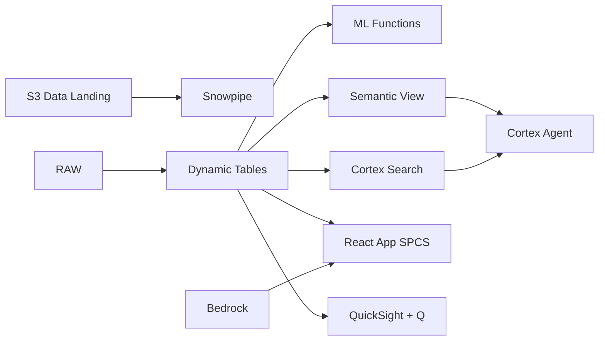

# EUDR Sustainability Compliance

Prepare for the EU Deforestation Regulation — Cortex Search indexes the full EUDR text, AI_PARSE_DOCUMENT extracts certification data, and Dynamic Tables track plantation-level compliance gaps.

## Architecture

Malaysia is the world's second-largest palm oil producer. EU Regulation 2023/1115 (EUDR) requires full deforestation-free proof for every shipment entering the EU by December 2025. A major Malaysian palm oil group with 200 plantations finds 23 estates non-compliant — putting RM 4.8B in annual EU export revenue at risk. The compliance team needs to parse 500 regulation clauses, audit 1,500 certifications, and close gaps in 87 days.



## Snowflake Capabilities

| Capability | Implementation |
|-----------|---------------|
| Dynamic Tables | PLANTATION_COMPLIANCE_STATUS / CERTIFICATION_TIMELINE / SUPPLY_CHAIN_TRACEABILITY / DEFORESTATION_RISK_SCORE |
| ML Functions | ML.CLASSIFICATION |
| Cortex AI | AI_PARSE_DOCUMENT, AI_EXTRACT, SUMMARIZE |
| Cortex Search | 500 documents indexed |
| Cortex Agent | EUDR_COMPLIANCE_AGENT |
| Semantic View | EUDR_COMPLIANCE_ANALYTICS |
| React App (SPCS) | 5 tabs + DemoGuide |


## AWS Services

| Service | Role in Demo |
|---------|-------------|
| Amazon S3 | Store certification PDFs, satellite imagery, and audit reports |
| Amazon Textract | OCR extraction from scanned certification documents |
| Amazon Bedrock (Claude) | Interpret EUDR clauses and generate compliance narratives |
| Amazon Comprehend | Entity extraction from regulatory text |
| Amazon QuickSight + Q | Executive compliance dashboard with natural language queries |
| AWS Lambda | Event-driven processing of new document uploads |


## Personas

| Persona | Role | Key Questions |
|---------|------|---------------|
| **Dato' Sri Mohd Bakke** | CEO Palm Oil Group | "How many plantations are non-compliant with EUDR?" "What's our total export revenue at risk?" |
| **Dr. Ng Siew Mei** | Sustainability Director | "Which plantations are missing geolocation evidence?" "Show me the certification expiry timeline." |


## Data

| Table | Rows | Description |
|-------|------|-------------|
| PLANTATIONS | 200 | Oil palm plantations with geolocation, concession area, and ownership |
| CERTIFICATIONS | 1,500 | RSPO, MSPO, ISCC certifications with expiry dates and scope |
| SUPPLY_CHAIN_EVENTS | 50,000 | Plantation-to-mill-to-port supply chain transactions |
| EUDR_REQUIREMENTS | 500 | EU Regulation 2023/1115 clauses parsed into structured requirements |
| COMPLIANCE_DOCS | 150 | Due diligence statements, audit reports, satellite imagery reports |
| DEFORESTATION_ALERTS | 5,000 | Global Forest Watch alerts within concession boundaries |
| MPOB_REFERENCE | 50 | Malaysian Palm Oil Board regulatory guidance and standards |


## Build Instructions

### Prerequisites
- Snowflake account with ACCOUNTADMIN access
- Cortex AI enabled (ML Functions, Search, Agent)
- Warehouse: EUDR_WH (Medium)
- AWS CLI with access (us-west-2)

### Deployment

```bash
snowsql -f snowflake/00_setup.sql
snowsql -f snowflake/01_marketplace_install.sql
snowsql -f snowflake/02_raw_tables.sql
snowsql -f snowflake/03_staging.sql
snowsql -f snowflake/04_dynamic_tables.sql
snowsql -f snowflake/05_search.sql
snowsql -f snowflake/06_ml_models.sql
snowsql -f snowflake/07_semantic_view.sql
snowsql -f snowflake/08_agent.sql
```

### React App (SPCS)
```bash
cd app && npm ci && npm run build
docker build -t aws-malaysia-palm-oil-eudr-app .
docker push bdiqc8sm-default.registry.snowflakecomputing.com/palm_oil_eudr/app/aws_malaysia_palm_oil_eudr/app:latest
```

### Demo Mode
Open the app URL with `?demo=true` for presenter view.

## Build Modes

### Snowflake Only
Run scripts 00-08 (skip AWS-specific integration). Uses:
- **Snowflake Internal Stage + Directory Tables** instead of Amazon S3
- **AI_PARSE_DOCUMENT** instead of Amazon Textract
- **Cortex Complete** instead of Amazon Bedrock (Claude)
- **AI_EXTRACT** instead of Amazon Comprehend
- **Snowflake Intelligence (Cortex Analyst)** instead of Amazon QuickSight + Q
- **Snowflake Tasks + Streams** instead of AWS Lambda

### Full AWS + Snowflake
Run all scripts including AWS integration. Deploy QuickSight dashboard from `quicksight/`.

## Business Impact

Industry research and Snowflake customer outcomes:
- **Malaysia exported RM 73.5B (US$16B) of palm oil products in 2023, with EU as 2nd largest market** — [MPOB](https://bepi.mpob.gov.my/)
- **EUDR affects 18% of Malaysian palm oil exports — estimated RM 4.8B at immediate risk** — [MPOC](https://mpoc.org.my/)
- **Non-compliance penalties include market exclusion and fines up to 4% of EU annual turnover** — [EU Commission](https://environment.ec.europa.eu/topics/forests/deforestation/regulation-deforestation-free-products_en)
- **RSPO-certified plantations command 5-8% price premium over conventional palm oil** — [RSPO](https://rspo.org/impact/)


## Key Demo Numbers

- **87 days** until EUDR compliance deadline
- **200 plantations** assessed for EUDR readiness
- **23 non-compliant (11.5%)** plantations failing EUDR requirements
- **RM 4.8B** annual export revenue at risk
- **500 EUDR clauses** indexed in Cortex Search
- **1,500 certifications** parsed by AI_PARSE_DOCUMENT
- **47 certifications** expired or expiring within 60 days


## License

Apache 2.0 — See [LICENSE](LICENSE) for details.

This is a personal demo project and is not an official Snowflake offering. It comes with no support or warranty.